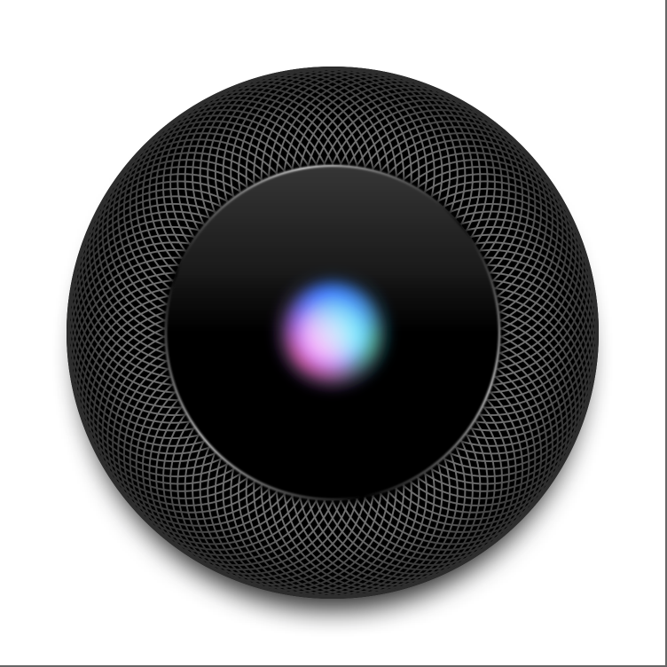

# Homepod SwiftUI
Homepod top view fully built with SwiftUI, follow the video by [CodeSlicing](https://twitter.com/CodeSlice).

# Menu
* [Screenshots](#screenshots)
* [Source](#source)
* [Contributions](#contributions)
* [Contact](#contact)

# Screenshots

# Source
Tutorials: [CodeSlicing](https://twitter.com/CodeSlice).

# Contributions

* All kinds of contributions (enhancements, new features, documentation & code improvements, issues & bugs reporting & todo task) are welcome. Let's make it better.

# Contact
Created by [Terry Kuo](https://twitter.com/ArgonYoYo) - feel free to contact me!
